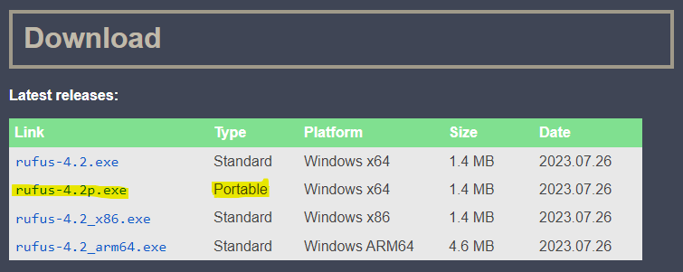
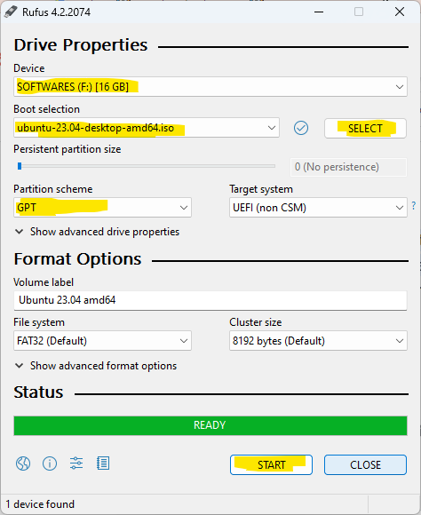

# Prepare Ubuntu Installation on Pendrive

## Introduction
This article is for creating bootable pendrive for Ubuntu installation.

## Required Downloads
- Rufus - *Rufus is a utility that helps format and create bootable USB flash drives*
- Ubuntu ISO

## Steps:
1. Download rufus (portable) from this [link](https://rufus.ie/en/)

2. Download ubuntu desktop ISO from this [link](https://ubuntu.com/download/desktop). In our case we are using `Ubuntu 23.04` 

3. Follow the instructions that are marked (yellow) in the picture:
    - Select Device - Select the pendrive/USB flash drive you want to make bootable. ***Be careful! The device you select will be formatted.***
    - Click on `SELECT` for Boot selection - Select the Ubuntu ISO image you recently downloaded. In our case it is `ubuntu-23.04-desktop-amd64.iso`, which we have downloaded in the previous step.
    - Select `Partition scheme` - GPT
    - Click on `START`
    - Click on `Ok` on the following screen
    - Wait until the process is finished.
 

**The process of creating bootable usb drive for other Operating System is similar. You need to grab the ISO file for your desired operating system.** A list of OS and their ISO download links are given below.

- [Windows 11](https://www.microsoft.com/software-download/windows11)
- [Windows 10](https://www.microsoft.com/en-us/software-download/windows10)
- [Linux Mint](https://www.linuxmint.com/download.php)
- [Kali Linux](https://www.kali.org/get-kali/)
- [Arch Linux](https://archlinux.org/download/)

