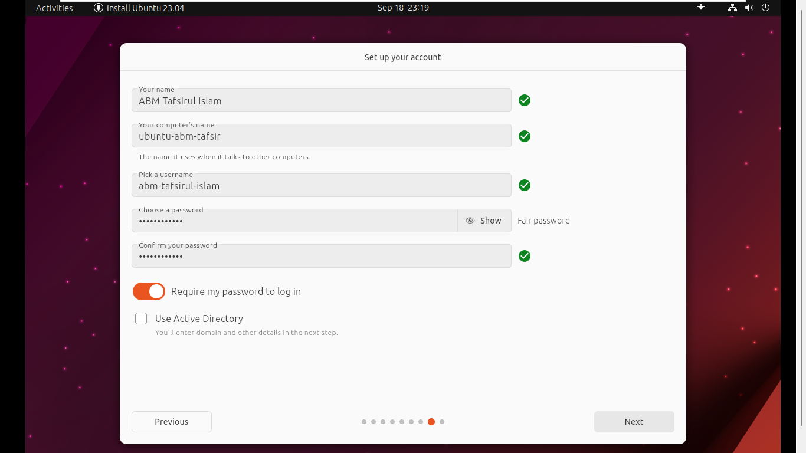

# Ubuntu Installation Guide for Dual Boot

## Introduction
Welcome to our comprehensive guide on setting up a dual boot configuration for Ubuntu on our PC. Dual booting allows us to install Ubuntu alongside our existing operating system, giving us the flexibility to choose between them during startup. In this guide, we'll take you through the entire installation process, ensuring that you can comfortably enjoy the benefits of Ubuntu without losing access to our current OS. Whether you're a Linux enthusiast or just getting started, we've got you covered with detailed instructions and useful tips. Let's begin our journey to a dual-boot Ubuntu setup!


## Steps

1. Boot ubuntu from installation prndrive from BIOS menu.

2. Select Language- `English` 


3. Select `Install Ubuntu`


4. Select language - `English(US)`


5. Select wifi device and connect to `pstbd wifi network`


6. Select the followings shown in the picture below:
    - What app would you like to install to start with? 
    ```
    Normal Installation
    ```
    - Mark the `Other options` as shown in the picture below
    
    

7. Select `Manual Partitioning`


8. In `Manual Partioning` click on `+` and select `Mount Point` as `/`


9. Click `Next`


10. Click `Install`


11. Click `Next`
 

12. Set the followings:
    - Your name
    - Your computer's name
    - Choose a password
    - Confirm your password
    - Click `Next`
    
    
    

13. Select your theme and click `Next`


After all these steps the installation will finised. It will take aprroximately 15-25 minutes to install. 

## Workspace Setup
Use the following script to install required packages and apps for our workspace. 
This script will install the following Apps/Packages:
- MS Edge
- VS Code
- git
- vim
- gedit

**Steps**
- Copy the following script and save it in your device as `setup_workspace.sh`
  ```
  #!/bin/bash

  # Update Packages
  sudo apt update && sudo apt upgrade -y

  # Install Required Packages
  sudo apt install vim git gedit -y

  # Install MS Edge
  sudo apt install software-properties-common apt-transport-https wget -y
  wget -q https://packages.microsoft.com/keys/microsoft.asc -O- | sudo apt-key add -
  sudo add-apt-repository "deb [arch=amd64] https://packages.microsoft.com/repos/edge stable main" -y
  sudo apt update
  sudo apt install microsoft-edge-stable -y

  # Install VS Code (https://code.visualstudio.com/docs/setup/linux)
  sudo apt-get install wget gpg -y
  wget -qO- https://packages.microsoft.com/keys/microsoft.asc | gpg --dearmor > packages.microsoft.gpg
  sudo install -D -o root -g root -m 644 packages.microsoft.gpg /etc/apt/keyrings/packages.microsoft.gpg
  sudo sh -c 'echo "deb [arch=amd64,arm64,armhf signed-by=/etc/apt/keyrings/packages.microsoft.gpg] https://packages.microsoft.com/repos/code stable main" > /etc/apt/sources.list.d/vscode.list'
  rm -f packages.microsoft.gpg

  sudo apt install apt-transport-https -y
  sudo apt update
  sudo apt install code -y # or code-insiders
  ```
- Make this script executable by using the following command
  ```
  chmod +x setup_workspace.sh
  ```
- Finally, run the script
  ```
  ./setup_workspace.sh
  ```

## Troubleshooting
### 1. Ubuntu `grub` (OS Selection Menu) missing after starting Windows for the first time after dual booting.
**Fix**
- Open windows Command Prompt as **admin**.
- Run the following command
```
bcdedit /set {bootmgr} path \EFI\ubuntu\grubx64.efi
```
*If you don't have secure boot turned on, then use `shimx64.efi` instead of `grubx64.efi`*

You can visit this [link](https://www.makeuseof.com/fix-grub-not-showing-in-dual-boot-setup/), if you still find problem.

### 2. Change `grub` menu OS order
- To Change the grub menu order we will use the `grub-customizer`. To install `grub-customizer` run the following commands.
  ```
  sudo add-apt-repository ppa:danielrichter2007/grub-customizer
  ```
  Press `Enter` to confirm the operation. Then run the following command.
  ```
  sudo apt install grub-customizer
  ```
- Now search for `grub customizer` and open it.
- From the `List configuration` tab, select any OS and use the dedicated buttons to move its position in the menu.
- Don't forget to hit the save button after you are done.

More details can be found [here](https://itsfoss.com/install-grub-customizer-ubuntu/).
